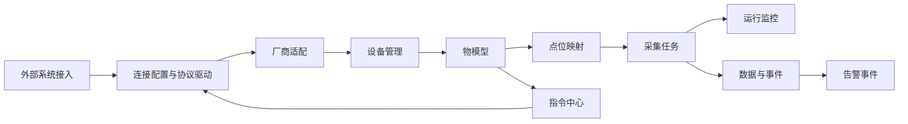
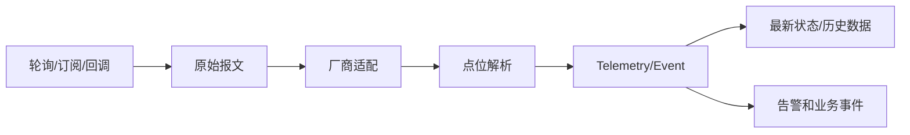
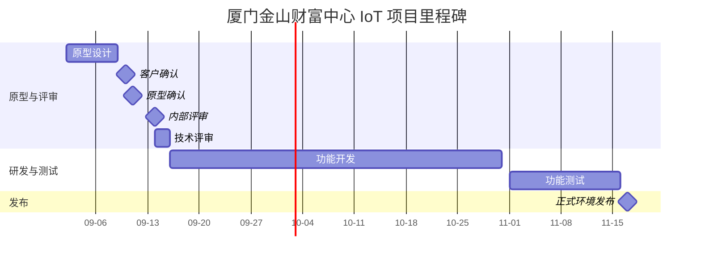

# 厦门金山财富中心 IoT 管理台
## 产品概要设计文档

**文档版本：** V1.0  
**编制日期：** 2026-09-14  
**项目名称：** 厦门金山财富中心项目  
**文档定位：** 产品概要设计  
**适用对象：** 产品、架构、研发、测试、实施、运维、客户评审人员  
**数据规范：** 设备编码、属性、事件、服务及点位映射遵循物模型统一语义；协议来源保留 JSONPath、MQTT Topic、寄存器地址或 OPC UA NodeId；时间、单位、精度、枚举和值域按物模型配置。其他编码、租户、坐标、数据留存规范【待补充】。

---

## 一、项目概述
### 1.1 项目背景
厦门金山财富中心需要对接海康综合安防、科拓智慧停车、安科瑞能源管理、视声智能照明等外部系统及设备。现有方案需要统一管理接入系统、连接配置、协议驱动、设备、物模型、点位映射、采集任务、控制指令和告警事件。本阶段通过静态 HTML 原型确定信息架构、页面入口、核心字段和交互关系，供产品评审及后续研发拆分使用。

### 1.2 产品定位
IoT 管理台是面向项目运维和设备运营人员的统一接入与设备能力管理平台，通过物模型和点位映射屏蔽厂商协议差异，支撑设备数据采集、状态监控、控制下发和告警处理。

**核心价值：**

+ 统一管理外部系统连接、认证、环境和协议配置。
+ 以物模型表达设备属性、事件和控制服务，形成统一设备能力语言。
+ 通过点位映射将 HTTP、MQTT、Modbus、OPC UA、BACnet 等原始数据转换为统一业务数据。

### 1.3 建设目标
1. 建立 IoT 总览及接入、设备、物模型、点位、采集、监控、指令、告警的完整产品信息架构。
2. 支持新增接入、注册设备、创建物模型、配置点位映射等核心配置流程的原型交互验证。
3. 明确上行采集、下行控制、ACK/回调/状态回读确认及异常处理边界，为后续真实接口研发提供依据。

### 1.4 产品范围
#### 1.4.1 本期核心范围
+ IoT 总览工作台：接入状态、设备状态、运行指标、快捷入口和事件时间线。
+ 接入管理：厂商系统、连接配置、认证、环境、协议、接口目录和运行日志。
+ 设备管理：设备注册、设备编码、厂商、位置、所属接入、物模型和在线状态。
+ 物模型、点位映射、采集任务、运行监控、指令中心、告警事件。

#### 1.4.2 可选扩展范围
+ 设备详情中的楼栋、楼层、空间树展示【待补充】。
+ 控制操作的二次确认、审批或双人复核【待补充】。
+ 告警确认、屏蔽、升级和关闭流程【待补充】。
+ 独立网关页面或网关拓扑节点管理【待补充】。

#### 1.4.3 非产品范围
+ 本阶段不接真实 API、MQTT Broker 或工业设备。
+ 本阶段不确定最终时序数据库。
+ 本阶段不实现动态脚本解析、规则引擎和插件市场。
+ 不直接复制现有旧项目表结构。

### 1.5 成功标准
+ 静态 HTML 可打开完整菜单和 IoT 总览布局，桌面端及窄屏无主要内容重叠。
+ 新增接入、注册设备、创建物模型、配置点位映射均可打开配置抽屉，取消、关闭、保存反馈可用。
+ 接入、设备、物模型、点位、采集和控制概念均有明确入口，核心上行/下行流程和验收边界可供评审确认。

---

## 二、产品受众
### 2.1 用户角色总览
| 角色分类 | 具体角色 | 典型数量级 | 使用终端 |
| --- | --- | ---: | --- |
| 项目运营 | 楼宇/项目运维人员 | 【待补充】 | IoT 管理台 Web |
| 平台配置 | IoT 平台管理员、实施人员 | 【待补充】 | IoT 管理台 Web |
| 评审与交付 | 客户、产品、研发、测试、运维 | 【待补充】 | Web 原型、管理台 |

### 2.2 角色详细定义
| 角色 | 角色描述 | 核心诉求 |
| --- | --- | --- |
| 项目运维人员 | 查看接入、设备运行状态、采集结果、告警和指令执行情况 | 快速发现异常并跟踪处理 |
| IoT 平台管理员/实施人员 | 配置外部系统、连接认证、协议、设备、物模型、点位和采集任务 | 正确接入厂商系统并完成设备能力标准化 |
| 评审与交付人员 | 评审信息架构、交互范围、里程碑和验收结果 | 确认范围、依赖和交付条件 |

### 2.3 权限设计原则
+ 菜单、操作和数据范围应按组织、项目及角色隔离；具体租户模型和数据范围【待补充】。
+ 遵循身份认证、授权和最小权限原则；原始报文查看、控制下发等高风险操作需单独授权。
+ 接入、设备、物模型、点位、任务、指令和告警分别配置菜单及操作权限。
+ 权限变更、控制下发、连接测试和配置保存应保留审计记录；回收和异常处理规则【待补充】。

---

## 三、产品形态
### 3.1 产品形态总览
| 产品形态 | 主要用户 | 核心职责 | 建设优先级 |
| --- | --- | --- | :---: |
| IoT 管理台 Web | 项目运维、平台管理员、实施人员 | 接入配置、设备与物模型管理、采集监控、控制和告警 | P0 |
| 静态 HTML 交互原型 | 产品、研发、测试、客户评审 | 验证信息架构、页面入口、字段和交互边界 | P0 |

### 3.2 产品终端说明
#### 3.2.1 IoT 管理台 Web
面向项目运维、平台管理员和实施人员，提供左侧菜单、顶部上下文栏、总览指标、列表、详情和配置抽屉。负责外部系统接入、设备注册、物模型及点位配置、采集任务编排、运行监控、控制指令和告警事件管理。

#### 3.2.2 静态 HTML 交互原型
用于产品排版和技术评审，验证页面结构、菜单、字段和交互关系；保存操作仅提供静态反馈，不写入数据库。

#### 3.2.3 移动端
【待补充】

#### 3.2.4 大屏端
【待补充】

#### 3.2.5 外部系统/设备端
作为被接入对象提供 HTTP、MQTT、TCP、串口、Modbus、OPC UA、BACnet 等协议及厂商认证、报文和回调语义；具体系统由外部厂商负责。

---

## 四、业务架构
### 4.1 整体业务架构图


### 4.2 业务模块划分
| 业务域 | 所属终端 | 模块/核心功能 |
| --- | --- | --- |
| 接入配置 | IoT 管理台 Web | 接入管理：厂商系统、连接、认证、环境、协议、接口目录 |
| 设备能力 | IoT 管理台 Web | 设备管理、物模型、点位映射 |
| 数据采集 | IoT 管理台 Web | 采集任务、运行监控、原始报文、失败与延迟 |
| 设备控制 | IoT 管理台 Web | 指令中心：下发、ACK/回调/状态回读、超时和审计 |
| 运维处置 | IoT 管理台 Web | 告警事件：故障、离线、越界和厂商告警 |

### 4.3 核心业务流程概览
#### 4.3.1 外部系统接入配置

参与角色为平台管理员或实施人员。传输方式包括 HTTP、MQTT、TCP、串口；协议包括 HTTP JSON、MQTT、Modbus TCP、Modbus RTU、OPC UA、BACnet/IP。连接失败时返回配置调整，不进入可用状态。

#### 4.3.2 物模型创建与发布
创建产品类型，配置属性、事件和服务，完成版本发布；已绑定设备使用明确的物模型版本。版本规则和回滚策略【待补充】。

#### 4.3.3 设备注册与点位映射
注册设备并填写设备编码、名称、厂商、位置和所属接入，绑定产品/物模型，配置原始数据来源及解析规则，在线测试一条数据并预览“原始值 -> 统一值”。

#### 4.3.4 上行采集

采集任务负责频率、超时、重试、批量读取和失败处理；业务码失败不能仅按 HTTP 200 判定成功。

#### 4.3.5 下行控制

控制成功以 ACK、回调或状态回读为准，不以 HTTP 200 单独判定。

---

## 五、功能架构
### 5.1 IoT 管理台
```plain
IoT 管理台
│
├── 【一】IoT 总览
│   ├── 接入状态
│   ├── 设备状态
│   ├── 运行指标
│   └── 运行事件时间线
│
├── 【二】接入管理
│   ├── 接入系统
│   ├── HTTP 基础连接
│   ├── 接口目录
│   ├── 回调配置
│   └── 运行日志
│
├── 【三】设备管理
│   ├── 设备注册
│   ├── 设备状态与位置
│   └── 设备详情
│
├── 【四】物模型
│   ├── 产品类型
│   ├── 属性
│   ├── 事件
│   └── 控制服务
│
├── 【五】点位映射
│   ├── 原始数据来源
│   ├── 解析规则
│   └── 原始值到统一值测试
│
├── 【六】采集任务
│   ├── 轮询
│   ├── 订阅
│   ├── 回调
│   ├── 频率/超时/重试
│   └── 批量读取
│
├── 【七】运行监控
│   ├── 连接状态
│   ├── 采集任务
│   ├── 报文
│   ├── 失败
│   └── 延迟
│
├── 【八】指令中心
│   ├── 控制任务
│   ├── 指令下发
│   ├── 确认与超时
│   └── 审计记录
│
└── 【九】告警事件
    ├── 设备故障
    ├── 设备离线
    ├── 属性越界
    └── 厂商告警
```

### 5.2 外部协议与数据链路
```plain
外部系统/设备
│
├── HTTP/HTTP JSON
├── MQTT
├── TCP/串口
├── Modbus TCP/RTU
├── OPC UA
└── BACnet/IP
    ├── 连接配置
    ├── 协议驱动
    ├── 厂商适配
    ├── 点位解析
    └── 物模型属性/事件/服务
```

### 5.3 重点功能概要
#### 5.3.1 接入与接口目录
+ 接入系统与公共 HTTP 连接配置分离，公共配置包括 Base URL、请求头、认证、签名算法和连接超时。
+ 接口目录逐接口配置方法、路径、用途、请求参数、响应映射、接口级超时和失败处理。
+ 支持连接测试和接入详情页签：基本信息、HTTP 基础连接、接口目录、回调配置、设备列表、运行日志。

#### 5.3.2 物模型与点位映射
+ 物模型定义属性、事件、控制服务及数据类型、单位、读写权限、范围和精度。
+ 点位映射承载 JSONPath、MQTT Topic、寄存器地址、NodeId、字节序、缩放、偏移、枚举和质量规则。
+ 原始协议细节不写入业务属性名称，通过在线测试预览原始值到统一值的结果。

#### 5.3.3 采集与运行监控
+ 采集任务支持定时轮询、MQTT 订阅、厂商回调和手动执行。
+ 任务配置执行频率、单次超时、失败重试、重试间隔、失败后保留上次值/标记离线/触发告警。
+ 运行监控展示连接、任务、报文、失败和延迟。

#### 5.3.4 指令中心
+ 控制请求校验设备、服务和参数后创建指令任务。
+ 支持开启道闸、关闭照明、远程开门、播放广播等物模型服务示例。
+ 记录执行超时、重试、ACK、回调、状态回读确认和操作原因。

#### 5.3.5 告警事件
+ 支持设备故障、设备离线、属性越限、数据质量异常、厂商事件和指令超时规则。
+ 告警规则包括适用范围、监测属性/事件、判断条件、阈值/持续时间、等级、恢复条件和通知方式。
+ 告警确认、屏蔽、升级、关闭流程【待补充】。

---

## 六、产品迭代计划
### 6.1 整体迭代计划
#### 6.1.1 规划依据与约束
| 规划项 | 填写内容 |
| --- | --- |
| 项目交付目标 | 完成 IoT 管理台原型评审、研发、测试及正式环境发布；具体量化指标【待补充】 |
| 时间基线 | 原型设计 2026-09-02 至 2026-09-09；客户确认 2026-09-10 至 2026-09-11；内部评审 2026-09-14；正式发布 2026-11-17；以里程碑图片为准 |
| 现有能力 | 已有静态 HTML 原型、菜单、配置抽屉和页面交互；真实服务端能力【待补充】 |
| 资源基线 | 产品、UI、技术、开发、测试及实施人员已列入里程碑负责人；人数和投入比例【待补充】 |
| 外部依赖 | 接口文档、设备数据、客户确认、技术框架和测试环境；接口资料预计 2026-09-17 前完成对接输入 |
| 估算口径 | 日期按里程碑图片填写；工作日历、工作量、人日和缓冲【待补充】 |

#### 6.1.2 迭代规划原则
+ **SMART 原则：** 每个迭代目标应具体、可衡量、可实现、与项目目标相关且有明确时限；指标值【待补充】。
+ **MVP 原则：** 首个可交付版本覆盖总览、接入、设备、物模型、点位和基本采集闭环；真实接口范围【待补充】。
+ **按交付日期倒排：** 按需求确认、原型、技术评审、开发、测试、发布节点倒排。
+ **依赖与资源匹配：** 先完成接口资料、原型和技术框架，再进行功能开发与设备数据测试。
+ **范围与质量平衡：** 变更需同步更新功能范围、排期和验收条件。

#### 6.1.3 迭代版本总览
| 迭代版本 | 目标与衡量指标 | 产品端及核心模块 | 计划起止日期 | 周期 | 关键里程碑/交付物 | 主要依赖 |
| --- | --- | --- | --- | --- | --- | --- |
| 迭代 0：原型与确认 | 完成内容设计、客户确认和内部评审 | 静态原型、IoT 总览及九类页面 | 2026-09-02 至 2026-09-14 | 【待补充】 | 原型设计 09-09；客户确认 09-11；内部评审 09-14 | 客户确认、技术框架 |
| 迭代 1：研发与测试 | 完成原型内容开发及功能测试 | 接入、设备、物模型、点位、采集、监控、指令、告警 | 2026-09-16 至 2026-11-16 | 【待补充】 | 功能开发 09-16 至 10-31；功能测试 11-01 至 11-16 | 接口文档、设备数据 |
| 迭代 2：发布 | 完成正式环境发布 | 全量 IoT 管理台 | 2026-11-17 | 1 日 | 正式环境发布 11-17 | 测试通过、发布环境 |

**MVP 范围边界：** 迭代 1；目标用户为项目运维、平台管理员和实施人员；最小闭环为接入配置—设备注册—物模型—点位映射—采集监控，并保留控制和告警入口。真实接口、审批和高级告警处置流程是否纳入【待补充】。

**总体周期与关键路径：** 2026-09-02 至 2026-11-17。关键路径为接口资料/客户确认 -> 原型与技术评审 -> 功能开发 -> 功能测试 -> 正式发布；缓冲安排【待补充】。

**项目甘特图：**


| 岗位 | 投入人数 | 2026-09-02~09-14 | 2026-09-16~10-31 | 2026-11-01~11-16 | 2026-11-17 |
| --- | --- | --- | --- | --- | --- |
| 产品/原型 | 【待补充】 | 设计、确认、评审 | 需求支持 | 缺陷确认 | 发布支持 |
| 技术/UI | 【待补充】 | 原型/UI/技术评审 | 技术框架与开发支持 | 问题修复 | 发布支持 |
| 开发 | 【待补充】 | 【待补充】 | 功能开发 | 缺陷修复 | 发布支持 |
| 测试 | 【待补充】 | 测试用例准备 | 【待补充】 | 功能测试 | 发布验证 |

### 6.2 产品迭代说明
#### 6.2.1 迭代基本信息
| 项目 | 填写内容 |
| --- | --- |
| 迭代版本 | 迭代 1：研发与测试 |
| 迭代目标 | 完成 IoT 管理台核心模块开发和功能测试；量化指标【待补充】 |
| 计划周期 | 2026-09-16 至 2026-11-16 |
| 迭代负责人 | 【待补充】；里程碑开发负责人为俞靖、陈少聪，测试负责人为杨垒 |
| 启动条件 | 接口文档已提供并完成对接、客户确认和技术框架评审 |
| 范围边界 | 纳入总览、接入、设备、物模型、点位、采集、监控、指令和告警；真实接口及高级审批规则【待补充】 |

#### 6.2.2 迭代功能范围
| 需求编号 | 产品端 | 模块（导航菜单） | 功能项 | 功能描述与边界 | 优先级 | 前置依赖 | 验收标准 |
| --- | --- | --- | --- | --- | --- | --- | --- |
| IOT-001 | IoT 管理台 | IoT 总览 | 运行总览 | 展示接入、设备、采集率、告警和近期事件 | P0 | 原型确认 | 菜单和工作台布局可访问 |
| IOT-002 | IoT 管理台 | 接入管理 | 新增接入/接口目录 | 配置传输方式、协议、认证、环境、接口和回调 | P0 | 接口文档 | 可打开配置抽屉并完成字段校验 |
| IOT-003 | IoT 管理台 | 设备管理 | 注册设备 | 填写设备编码、名称、厂商、位置、所属接入并绑定物模型 | P0 | 接入、物模型 | 可打开注册设备抽屉 |
| IOT-004 | IoT 管理台 | 物模型 | 产品类型、属性、事件、服务 | 定义设备能力和发布版本 | P0 | 业务对象确认 | 属性/事件/服务入口可访问 |
| IOT-005 | IoT 管理台 | 点位映射 | 原始数据映射 | 配置 JSONPath、Topic、寄存器、类型、字节序、缩放和质量规则 | P0 | 设备、物模型 | 可在线测试原始值到统一值 |
| IOT-006 | IoT 管理台 | 采集任务/运行监控 | 采集与运行 | 配置轮询、订阅、回调、频率、超时、重试并查看失败和延迟 | P0 | 接入、点位 | 任务和监控入口可访问 |
| IOT-007 | IoT 管理台 | 指令中心 | 控制下发 | 校验服务参数并跟踪 ACK、回调、状态回读、超时和审计 | P1 | 物模型、设备 | 指令状态和确认方式可展示 |
| IOT-008 | IoT 管理台 | 告警事件 | 告警规则与事件 | 支持故障、离线、越界、厂商事件和指令超时 | P1 | 采集、设备 | 告警规则字段和事件列表可展示 |

#### 6.2.3 岗位投入与排期
迭代 1 人员配置：产品、UI/UX、前端、后端、测试、实施/运维人数及比例【待补充】。  
迭代 1 岗位甘特图：按项目甘特图执行。  
迭代 1 关键节点：功能开发完成 2026-10-31；功能测试完成 2026-11-16。

| 任务编号 | 岗位 | 工作内容/交付物 | 投入人数 | 人均投入比例 | 工作量（人日） | 计划起止日期 | 前置任务 |
| --- | --- | --- | --- | --- | --- | --- | --- |
| T1 | 产品/UI | 原型确认、页面细化 | 【待补充】 | 【待补充】 | 【待补充】 | 2026-09-02~09-14 | 无 |
| T2 | 技术/开发 | 技术框架与功能开发 | 【待补充】 | 【待补充】 | 【待补充】 | 2026-09-16~10-31 | T1、接口文档 |
| T3 | 测试 | 功能测试与缺陷验证 | 【待补充】 | 【待补充】 | 【待补充】 | 2026-11-01~11-16 | T2 |

#### 6.2.4 交付物与完成条件
| 交付项 | 交付物/版本 | 完成条件 | 验证方式/证据 | 验收责任人 | 计划完成日期 |
| --- | --- | --- | --- | --- | --- |
| 原型与产品设计 | IoT 管理台静态 HTML、产品概设 | 页面入口、字段、交互和边界完成评审 | 客户确认、内部评审记录 | 【待补充】 | 2026-09-14 |
| 功能开发 | IoT 管理台研发版本 | 核心模块可访问，配置流程和状态展示符合需求 | 功能演示、测试记录 | 【待补充】 | 2026-10-31 |
| 功能测试 | 测试报告、缺陷清单 | 核心功能测试完成，遗留缺陷处理口径明确 | 测试报告、回归记录 | 杨垒 | 2026-11-16 |
| 正式发布 | 正式环境版本 | 发布检查通过并可使用 | 发布记录 | 高文良 | 2026-11-17 |

#### 6.2.5 依赖、风险与调整安排
| 关联事项编号 | 依赖/风险/变更事项 | 影响范围 | 最晚确认/就绪日期 | 应对或调整方案 | 责任人 | 状态/结论 |
| --- | --- | --- | --- | --- | --- | --- |
| R-001 | 接口文档和设备数据需完成对接 | 开发、联调、测试 | 2026-09-17 | 先冻结字段和映射边界，缺失项标记待补充 | 俞靖 | 待确认 |
| R-002 | 客户对控制审批、原始报文权限、告警闭环未确认 | 指令和告警模块 | 2026-09-14 | 评审时形成决策并更新范围 | 杨琪 | 待确认 |
| R-003 | 真实 API、MQTT Broker 和工业设备未接入 | 集成验收 | 2026-11-01 | 准备测试环境和联调数据 | 【待补充】 | 待确认 |

---

## 七、技术架构
### 7.1 技术选型原则
+ 优先采用稳定、可替换、生命周期明确的协议驱动和连接组件。
+ 以物模型作为业务语义边界，协议细节仅存在于点位映射。
+ 遵循最小权限、审计和密钥治理原则；认证信息不应在普通列表中明文展示。
+ 运行监控需可观测、可重试、可回退，并适配项目部署环境；具体技术栈【待补充】。

### 7.2 总体技术架构
```text
展示层：IoT 总览、接入、设备、物模型、点位、任务、监控、指令、告警
应用层：接入配置、设备注册、模型版本、映射测试、任务编排、指令与告警
领域层：协议驱动、厂商适配、物模型、Telemetry/Event、指令状态
数据层：最新状态、历史数据、配置、审计日志
集成层：HTTP、MQTT、TCP/串口、Modbus、OPC UA、BACnet
治理层：认证授权、密钥、监控、日志、告警、备份
```

### 7.3 技术栈基线
| 类别 | 技术/版本 | 主要用途 | 备注 |
| --- | --- | --- | --- |
| 前端 | HTML/CSS/JavaScript 原型 | 页面结构与交互验证 | 生产技术栈【待补充】 |
| 协议 | HTTP/HTTP JSON、MQTT、Modbus、OPC UA、BACnet | 外部系统和设备接入 | 以连接配置和协议驱动实现 |
| 数据存储 | 【待补充】 | 配置、状态、历史数据、审计 | 本阶段不确定最终时序数据库 |

### 7.4 数据架构
| 数据类型 | 存储与形态 | 权威写入方 | 核心治理要求 |
| --- | --- | --- | --- |
| 接入与连接配置 | 配置存储【待补充】 | IoT 管理台 | 认证、密钥、环境、版本和审计 |
| 设备与物模型 | 业务数据库【待补充】 | IoT 管理台 | 设备编码唯一，模型版本明确 |
| 点位映射 | 业务数据库【待补充】 | IoT 管理台 | 原始来源、目标对象、转换和质量规则可追溯 |
| Telemetry/Event | 实时/历史存储【待补充】 | 采集链路 | 时间、单位、质量、留存和幂等规则【待补充】 |
| 指令与告警 | 业务数据库/审计存储【待补充】 | 指令和告警模块 | 状态流转、确认方式、操作原因和审计 |

统一数据语义以物模型属性、事件和服务为准；主数据、编码、数据留存和分析投影【待补充】。

### 7.5 系统集成要求
#### 7.5.1 统一接口
+ HTTP 接入拆分为 Base URL/公共请求头/认证配置、API 接口目录、请求参数和响应映射。
+ 接口需定义方法、路径、用途、请求格式、设备识别字段、成功判断、错误码、数据列表、分页和目标物模型对象。
+ 认证支持 AppId/AppSecret、Token、签名算法等配置；版本、幂等、限流、兼容期和回退策略【待补充】。

#### 7.5.2 事件规范
事件至少应包含来源、主题、时间、链路标识、数据体和版本，并支持幂等、重试、死信及敏感信息治理；具体事件信封【待补充】。

#### 7.5.3 连接器规范
连接器需支持配置校验、资源发现、数据读写、订阅、指令调用、健康检查、版本和隔离；具体实现【待补充】。

#### 7.5.4 SSO 与外部免登
外部身份源、身份映射、令牌、退出同步、异常降级和审计要求【待补充】。

### 7.6 数据同步要求
| 同步场景 | 建议机制 | 一致性与失败处理 | 责任方 |
| --- | --- | --- | --- |
| 设备数据上行 | 轮询/订阅/回调 | 点位解析、质量校验、重试、保留上次值或告警 | IoT 平台 |
| 控制指令下行 | API/协议驱动 | ACK、回调或状态回读确认；超时和重试 | IoT 平台与厂商系统 |
| 厂商事件回调 | HTTP Callback/MQTT | 验签、幂等、失败重试和审计 | 厂商系统与 IoT 平台 |

### 7.7 部署与运行架构
+ 基础设施、中间件、应用和数据服务分层；启动顺序、就绪检查和网络边界【待补充】。
+ 部署形态、离线交付、环境差异、密钥、配置、备份、升级和回退方案【待补充】。

### 7.8 非功能要求
#### 7.8.1 安全
+ 按组织、项目和角色隔离数据；传输、存储、敏感数据、密钥、最小权限和高风险操作要求【待补充】。
+ 对连接测试、配置变更、控制下发、原始报文查看保留审计；安全测试和漏洞修复要求【待补充】。

#### 7.8.2 性能与容量
+ 设备数、并发、消息量、接口延迟、吞吐、任务并发和资源配额【待补充】。
+ 压测口径、容量基线和扩容策略【待补充】。

#### 7.8.3 可用性与容灾
+ 连接失败、超时、重试、熔断、降级和故障隔离规则按协议驱动及任务层分别配置。
+ SLA、备份、恢复、RPO/RTO、演练和版本回退【待补充】。

#### 7.8.4 可观测性
+ 监控连接状态、采集任务、报文、失败、延迟、指令和告警，并保留日志、链路和审计。
+ traceId、请求号、事件号等关联标识规范【待补充】。

---

## 八、验收建议
### 8.1 产品验收
+ 按平台管理员、实施人员和运维人员验收接入、设备、物模型、点位、采集、监控、指令和告警核心功能及权限。
+ 验收左侧菜单、顶部指标、列表、详情、配置抽屉、取消/关闭/保存反馈及窄屏布局。
+ 验收新增接入、注册设备、创建物模型、配置点位映射、在线测试、任务配置和控制确认等核心场景；通过标准【待补充】。

### 8.2 数据与集成验收
+ 验收设备编码、物模型属性/事件/服务、点位来源、单位、枚举、质量规则和原始值到统一值的可追溯性。
+ 验收 HTTP、MQTT、协议驱动、厂商回调、指令 ACK/回调/状态回读的正向、异常、重试和幂等。
+ 验收断网、重复、乱序、超时、业务码失败、数据异常和补偿场景；真实联调数据【待补充】。

### 8.3 技术与安全验收
+ 验收越权、敏感数据、密钥、默认口令、依赖漏洞和制品安全。
+ 验收监控、告警、日志、链路、备份恢复、故障演练和发布回退。
+ 验收并发、吞吐、延迟、资源、可用性和容灾指标；具体指标【待补充】。

---

## 九、风险、约束与待确认项
| 类别 | 事项 | 影响 | 建议处理 | 责任人/截止时间 |
| --- | --- | --- | --- | --- |
| 交付 | 接口文档、设备数据及测试环境就绪时间 | 影响联调和测试 | 按 2026-09-17 前完成资料对接；缺失项建立清单 | 俞靖/2026-09-17 |
| 产品 | 首页偏平台运维还是楼宇设备运营未确认 | 影响总览指标和信息层级 | 客户评审确定定位 | 【待补充】 |
| 产品 | 菜单是否按接入配置与设备运行分组未确认 | 影响导航结构 | 原型评审决策 | 【待补充】 |
| 权限 | 原始报文普通运维人员是否可见未确认 | 影响敏感数据权限 | 明确角色权限和审计规则 | 【待补充】 |
| 控制 | 控制是否需要二次确认、审批或双人复核未确认 | 影响指令中心流程 | 客户确认后纳入或排除 | 【待补充】 |
| 告警 | 告警确认、屏蔽、升级、关闭流程未确认 | 影响告警闭环 | 补充状态流转和责任人 | 【待补充】 |
| 技术 | 最终数据库、技术栈、部署和容灾指标未确认 | 影响架构和非功能验收 | 技术评审补充 | 【待补充】 |

---

## 十、版本记录
| 版本 | 日期 | 说明 | 作者 | 评审/审批 |
| --- | --- | --- | --- | --- |
| V1.0 | 2026-09-14 | 基于 IoT 方案与原型说明、项目里程碑编制初稿 | 【待补充】 | 【待补充】 |

## 附录 A：编制依据
1. 《产品概设模版.md》：提供固定章节结构、表格和表达组件。
2. 《IoT 方案与原型说明.md》：提供 IoT 管理台的信息架构、页面菜单、配置/运行流程、交互范围、非本阶段范围和验收标准。
3. `web/iot-console-prototype.html`：提供静态页面、字段、菜单、抽屉和列表交互。
4. 厦门金山财富中心项目里程碑节点图片：提供原型、接口对接、技术评审、开发、测试和发布节点。

## 附录 B：设计假设
+ 本文档将本阶段产品范围限定为 IoT 管理台 Web 及其静态 HTML 原型。
+ 真实外部 API、MQTT Broker、工业设备、数据库和生产技术栈尚未在输入材料中确认，相关内容不作为最终实现承诺。
+ 设备数量、用户规模、并发量、SLA、RPO/RTO、接口性能和数据留存期限均待项目评审补充。

## 附录 C：核心术语
| 术语 | 定义 |
| --- | --- |
| 协议驱动 | 负责 HTTP、MQTT、Modbus、OPC UA、BACnet 等连接和数据收发的组件。 |
| 厂商适配 | 负责海康、科拓、GVS、安科瑞等厂商认证、报文和回调语义转换的能力。 |
| 物模型 | 定义设备属性、事件和服务，表达设备业务含义的统一模型。 |
| 点位映射 | 将 JSON 字段、MQTT Topic、寄存器或 NodeId 映射到物模型对象的配置。 |
| Telemetry | 设备上行的遥测/状态数据。 |
| Event | 设备上行的事件数据，如故障、通行记录、停车入场。 |
| 指令任务 | 经设备、服务和参数校验后创建并跟踪执行结果的控制任务。 |
| ACK/回调/状态回读 | 用于确认控制指令是否真正成功的三类确认方式。 |

