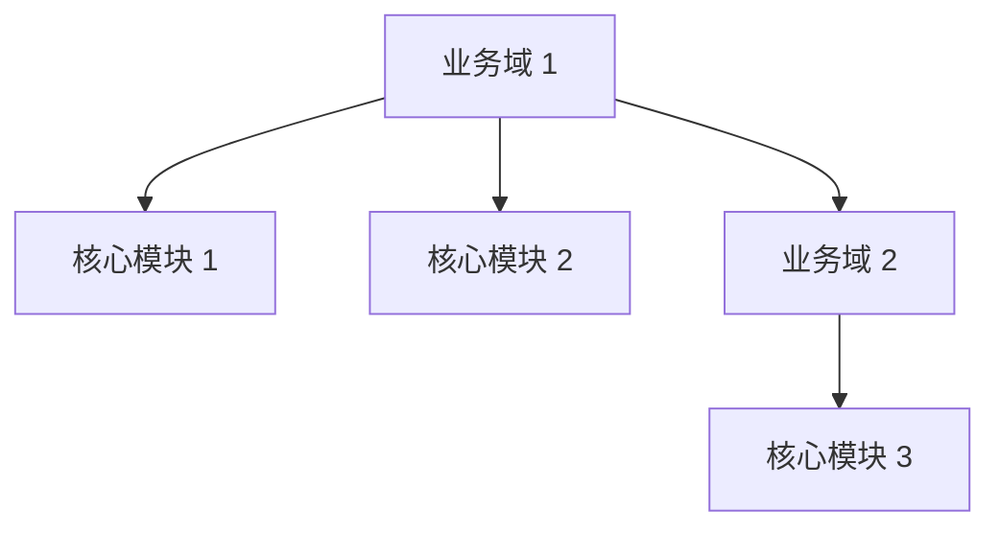
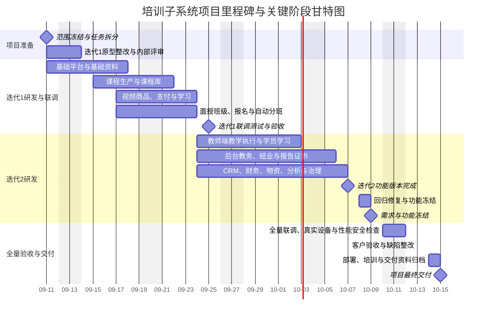

# [项目名称]
## 产品概要设计文档
> 本模板提取自《产品概要设计文档》的章节结构与表达组件。
>
> 使用规则：`[填写]` 为项目内容占位符；`[填写提示]` 仅用于指导编写，交付版应删除；表格、流程图和功能树可按项目实际情况增删，但不得遗漏范围、角色、架构、验收和风险信息。
>

---

**文档版本：** [填写，如 V1.0]  
**编制日期：** [填写]  
**项目名称：** [填写]  
**文档定位：** 产品概要设计  
**适用对象：** [填写：产品、架构、研发、测试、实施、运维、客户等]  
**数据规范：** [填写：核心数据标准、编码规则、坐标/时间/单位规范等]

---

## 一、项目概述
### 1.1 项目背景
> [填写提示：说明行业/客户现状、现有系统或业务痛点、建设动因、相关输入材料。]
>

[填写项目背景、问题和建设必要性。]

### 1.2 产品定位
> [填写提示：用一句话定义产品是什么、服务谁、解决什么问题；补充核心价值。]
>

[填写产品定位。]

**核心价值：**

+ [填写价值 1]
+ [填写价值 2]
+ [填写价值 3]

### 1.3 建设目标
> [填写提示：目标应可验证，覆盖业务目标、产品目标、数据目标和技术/交付目标。]
>

1. [填写目标 1]
2. [填写目标 2]
3. [填写目标 3]

### 1.4 产品范围
#### 1.4.1 本期核心范围
+ [填写本期核心能力/模块 1]
+ [填写本期核心能力/模块 2]

#### 1.4.2 可选扩展范围
+ [填写可选能力/后续模块 1]
+ [填写可选能力/后续模块 2]

#### 1.4.3 非产品范围
+ [填写明确不在本产品内建设的能力 1]
+ [填写由外部系统、专业工具或客户负责的内容]

### 1.5 成功标准
> [填写提示：描述项目完成后可观察、可验收的结果，避免只写“功能完成”。]
>

+ [填写成功标准 1]
+ [填写成功标准 2]
+ [填写成功标准 3]

---

## 二、产品受众
### 2.1 用户角色总览
> [填写提示：数量级为规划估算；根据产品端、组织层级和使用频率补充典型终端。]
>

| 角色分类 | 具体角色 | 典型数量级 | 使用终端 |
| --- | --- | ---: | --- |
| [填写] | [填写] | [填写] | [填写] |
| [填写] | [填写] | [填写] | [填写] |


### 2.2 角色详细定义
| 角色 | 角色描述 | 核心诉求 |
| --- | --- | --- |
| [填写] | [填写职责、边界和典型任务] | [填写] |
| [填写] | [填写] | [填写] |
|  |  |  |


### 2.3 权限设计原则
+ [填写租户/组织/项目/数据范围等隔离原则]
+ [填写身份认证、授权和最小权限原则]
+ [填写菜单、操作、字段、数据和高风险权限要求]
+ [填写权限变更、审计、回收和异常处理要求]

---

## 三、产品形态
### 3.1 产品形态总览
| 产品形态 | 主要用户 | 核心职责 | 建设优先级 |
| --- | --- | --- | :---: |
| [产品端/形态 1] | [填写] | [填写] | [P0/P1/P2] |
| [产品端/形态 2] | [填写] | [填写] | [P0/P1/P2] |


### 3.2 产品终端说明
#### 3.2.1 [产品终端名称]
> [填写提示：说明终端定位、主要用户、核心任务、边界、关键入口和与其他终端的协同关系。]
>

[填写终端说明。]

#### 3.2.2 [产品终端名称]
[填写终端说明。]

#### 3.2.3 [产品终端名称]
[填写终端说明。]

#### 3.2.4 [产品终端名称]
[填写终端说明。]

#### 3.2.5 [产品终端名称]
[填写终端说明。]

---

## 四、业务架构
### 4.1 整体业务架构图
> [填写提示：按“业务域—业务模块—核心能力”绘制；业务域/子域、模块、功能需标记出来，标明域之间的主要依赖或数据流。]
>



### 4.2 业务模块划分
| 业务域 | 所属终端 | 模块/核心功能 |
| --- | --- | --- |
| [填写] | [填写] | [填写，例如模块：功能] |
| [填写] | [填写] | [填写，例如模块：功能] |


### 4.3 核心业务流程概览
> [填写提示：列出端到端主流程，明确参与角色、关键状态、输入输出、异常分支和审计要求。]
> [产出物要求：以下流程图采用 Mermaid 泳道图，标注业务角色、系统节点、关键状态变化及异常分支；虚线箭头表示异常或退回路径。]


#### 4.3.1 [核心流程名称]


[填写流程说明、参与角色、关键规则和异常处理。]

#### 4.3.2 [核心流程名称]
[填写流程步骤或插入流程图。]

#### 4.3.3 [核心流程名称]
[填写流程步骤或插入流程图。]

#### 4.3.4 [核心流程名称]
[填写流程步骤或插入流程图。]

#### 4.3.5 [核心流程名称]
[填写流程步骤或插入流程图。]

---

## 五、功能架构
> [填写提示：本章描述产品端和功能模块的总体结构；页面级交互和字段级定义应进入FRD产品功能详设。]

### 5.1 [产品端名称]
```plain
[产品端名称]
│
├── 【一】[一级模块名称]
│   ├── [二级功能]
│   ├── [二级功能]
│   └── [二级功能]
│
├── 【二】[一级模块名称]
│   ├── [二级功能]
│   └── [二级功能]
│
└── 【三】[一级模块名称]
    ├── [二级功能]
    └── [二级功能]
```

### 5.2 [产品端名称]
```plain
[产品端名称]
│
├── 【一】[一级模块名称]
│   ├── [二级功能]
│   │   ├── [三级功能]
│   │   └── [三级功能]
│   └── [二级功能]
│
└── 【二】[一级模块名称]
    ├── [二级功能]
    └── [二级功能]
```

### 5.3 重点功能概要
#### 5.3.1 [重点能力名称]
+ [填写能力目标与适用范围]
+ [填写核心对象、关键规则和状态]
+ [填写与其他模块的关系及边界]

#### 5.3.2 [重点能力名称]
+ [填写]

#### 5.3.3 [重点能力名称]
+ [填写]

#### 5.3.4 [重点能力名称]
+ [填写]

#### 5.3.5 [重点能力名称]
+ [填写]

---

## 
## 六、产品迭代计划
> [填写提示：以项目交付日期、核心业务闭环和可用资源为依据，规划各迭代版本的目标、功能范围、岗位投入及交付条件。日期、人数、工作量和功能范围均按实际项目填写，未确认项标注“待确认”并说明确认责任人。]
>

### 6.1 整体迭代计划
#### 6.1.1 规划依据与约束
| 规划项 | 填写内容 |
| --- | --- |
| 项目交付目标 | [目标用户、核心业务闭环及可衡量的交付结果] |
| 时间基线 | [计划启动日期、最终交付日期、必须满足的里程碑及日期是否已确认] |
| 现有能力 | [可复用的产品、模块、技术底座及需要补齐的能力] |
| 资源基线 | [各岗位可投入人数、到岗时间、投入比例及共享资源限制] |
| 外部依赖 | [客户确认、第三方接口、设备、数据、环境等依赖及最晚就绪时间] |
| 估算口径 | [工作日历、工作量单位、估算依据、缓冲安排及待验证假设] |


#### 6.1.2 迭代规划原则
+ **SMART 原则：** 每个迭代目标应具体、可衡量、可实现、与项目目标相关且有明确时限；填写指标、目标值及验证方式。
+ **MVP 原则：** 首个可交付版本覆盖目标用户完成核心任务所需的最小业务闭环，明确纳入范围、暂缓范围和验证目标。
+ **按交付日期倒排：** 从最终交付节点倒排需求确认、设计、开发、联调、测试、缺陷修复及上线准备，结合依赖和资源校验可行性。
+ **依赖与资源匹配：** 优先安排后续版本依赖的公共能力和关键验证任务；共享人员按实际可用比例排期，避免并行任务重复占用同一资源。
+ **范围与质量平衡：** 为各版本明确交付条件，预留必要缓冲；范围或资源变化时重新评估工期、成本和业务目标。

#### 6.1.3 迭代版本总览
> [填写提示：每个版本填写一行；明确哪个版本承担 MVP 验证。版本范围应与第五章功能架构对应，周期须与起止日期及工作日历一致。]
>

| 迭代版本 | 目标与衡量指标 | 产品端及核心模块 | 计划起止日期 | 周期 | 关键里程碑/交付物 | 主要依赖 |
| --- | --- | --- | --- | --- | --- | --- |
| [填写，例如：迭代1] | [目标、指标及目标值] | [填写] | [开始日期至结束日期] | [工作日/周] | [成果及完成日期] | [前置版本/任务/资源] |


**MVP 范围边界：** [填写所属版本、目标用户、最小业务闭环、纳入能力及暂缓能力。]

**总体周期与关键路径：** [填写总体起止日期、周期、决定交付日期的依赖链及缓冲安排；存在并行迭代时，总周期不直接累加各迭代周期。]


**项目甘特图：** [在此插入本迭代按岗位和任务绘制的甘特图，或填写下方时间栅格；人员和日期应与岗位排期表一致。]
>示列如下：


| 岗位 | 投入人数 | [时间段及起止日期 1] | [时间段及起止日期 2] | [时间段及起止日期 N] |
| --- | --- | --- | --- | --- |
| [填写] | [填写] | [执行/里程碑/空白] | [执行/里程碑/空白] | [执行/里程碑/空白] |


> [填写提示：按日或周设置统一时间轴并增删列，用连续色块或“执行”标记任务区间；标明需求确认、设计评审、开发完成、联调、测试、缺陷修复、验收及交付节点。跨岗位可合理并行，依赖关系以任务编号关联。]
>

### 6.2 产品迭代说明
> [填写提示：按迭代版本复制以下 6.2.1～6.2.5 为一组，后续版本顺延为 6.3、6.4 等；迭代编号应与总览表一致。]
>

#### 6.2.1 迭代基本信息
| 项目 | 填写内容 |
| --- | --- |
| 迭代版本 | [填写] |
| 迭代目标 | [目标用户、业务结果、衡量指标及目标值] |
| 计划周期 | [开始日期、结束日期及工作日/周数] |
| 迭代负责人 | [姓名/角色] |
| 启动条件 | [已确认的需求、前置版本、接口、数据、环境及资源条件] |
| 范围边界 | [本迭代纳入内容、明确不纳入内容及后续归属] |


#### 6.2.2 迭代功能范围
| 需求编号 | 产品端 | 模块（导航菜单） | 功能项 | 功能描述与边界 | 优先级 | 前置依赖 | 验收标准 |
| --- | --- | --- | --- | --- | --- | --- | --- |
| [填写] | [填写] | [填写菜单层级/路径；无菜单项填写所属能力域] | [填写] | [用户操作、处理规则及预期结果] | [P0/P1/P2] | [需求/接口/数据/环境] | [可验证的结果或验收条目编号] |


> [填写提示：在本项目内统一优先级口径。P0 为当前版本目标必须具备的能力；P1 为重要增强能力；P2 为可择期安排的优化能力。优先级不等于交付承诺，纳入或移出版本需同步更新范围和排期。公共能力、接口和数据准备等无菜单任务也应列入。]
>

#### 6.2.3 岗位投入与排期
迭代 1 人员配置：[填写]
迭代 1 岗位甘特图：[填写]
迭代 1 关键节点：[填写]

| 任务编号 | 岗位 | 工作内容/交付物 | 投入人数 | 人均投入比例 | 工作量（人日） | 计划起止日期 | 前置任务 |
| --- | --- | --- | --- | --- | --- | --- | --- |
| [填写] | [填写] | [填写] | [填写] | [填写百分比；不同投入比例分行填写] | [填写] | [开始日期至结束日期] | [任务编号/无] |


> [填写提示：按实际岗位填写产品、UI/UX、前端、后端、测试、实施/运维等工作；每项任务单独列行。同一人在同一时段跨任务的投入比例合计不得超过可用比例。工作量是投入估算，不能直接作为日历工期；还需考虑依赖、节假日和沟通成本。]
>


#### 6.2.4 交付物与完成条件
| 交付项 | 交付物/版本 | 完成条件 | 验证方式/证据 | 验收责任人 | 计划完成日期 |
| --- | --- | --- | --- | --- | --- |
| [填写] | [文档、原型、可运行版本、测试报告等] | [功能、质量及缺陷处理标准] | [演示、测试记录、报告或附件] | [填写] | [填写] |


> [填写提示：完成条件应对应本迭代目标和第八章验收建议，写明适用的功能、数据、性能或安全要求及遗留问题处理口径。区分“开发完成”“测试通过”和“可交付”，避免以开发完成代替迭代验收。]
>

#### 6.2.5 依赖、风险与调整安排
| 关联事项编号 | 依赖/风险/变更事项 | 影响范围 | 最晚确认/就绪日期 | 应对或调整方案 | 责任人 | 状态/结论 |
| --- | --- | --- | --- | --- | --- | --- |
| [对应第九章事项编号或引用] | [填写] | [版本、功能、工期或资源] | [填写] | [验证、替代方案、范围调整或资源安排] | [填写] | [填写] |


> [填写提示：范围、依赖或人员变化时，记录原因、影响评估和确认结论，同步更新迭代总览、功能范围与岗位排期；跨迭代共性风险在第九章统一维护，本节引用并说明当前迭代的处理安排。]
>

---

## 七、技术架构
> 根据项目实施要求丰富技术架构内容
>

### 7.1 技术选型原则
+ [填写稳定性、可替换性和生命周期原则]
+ [填写模型驱动、单一写入责任或领域边界原则]
+ [填写安全、租户隔离、审计和密钥治理原则]
+ [填写可观测、可回退、可扩展和部署适配原则]

### 7.2 总体技术架构
> [填写提示：展示消费层、应用层、模型/领域层、内核/数据层、集成层和治理层；按实际项目调整。]
>


### 7.3 技术栈基线
| 类别 | 技术/版本 | 主要用途 | 备注 |
| --- | --- | --- | --- |
| [类别] | [技术/版本] | [用途] | [选型或兼容性说明] |
| [类别] | [技术/版本] | [用途] | [选型或兼容性说明] |


### 7.4 数据架构
| 数据类型 | 存储与形态 | 权威写入方 | 核心治理要求 |
| --- | --- | --- | --- |
| [数据类型] | [数据库/对象存储/消息等] | [服务或系统] | [租户、版本、质量、保留、审计等要求] |
| [数据类型] | [填写] | [填写] | [填写] |


[填写统一数据语义、主数据、编码、版本、质量、留存和分析投影要求。]

### 7.5 系统集成要求
#### 7.5.1 统一接口
+ [填写接口类型、版本策略和公开边界]
+ [填写认证、租户上下文、权限、限流、幂等、错误码和链路标识要求]
+ [填写破坏性变更、兼容期、迁移和回退策略]

#### 7.5.2 事件规范
[填写事件信封、事件版本、来源、主题、时间、链路、数据体、幂等、重试、死信和敏感信息要求。]

#### 7.5.3 连接器规范
[填写连接器的配置校验、资源发现、数据读写、订阅、指令调用、健康检查、版本和隔离要求。]

#### 7.5.4 SSO 与外部免登
+ [填写外部身份源接入和统一登录要求]
+ [填写外部系统免登、身份映射、令牌、退出同步、异常降级和审计要求]

### 7.6 数据同步要求
| 同步场景 | 建议机制 | 一致性与失败处理 | 责任方 |
| --- | --- | --- | --- |
| [同步场景] | [API/事件/任务/文件等] | [幂等、重试、补偿、对账等] | [系统/团队] |
| [同步场景] | [填写] | [填写] | [填写] |


### 7.7 部署与运行架构
+ [填写基础设施、中间件、应用和数据服务分层]
+ [填写启动顺序、就绪检查、入口暴露和网络边界]
+ [填写部署形态、架构兼容、离线交付和环境差异]
+ [填写密钥、配置、备份、升级和回退管理]

### 7.8 非功能要求
#### 7.8.1 安全
+ [填写数据隔离、传输/存储保护、敏感数据和密钥要求]
+ [填写最小权限、高风险操作、审计和合规要求]
+ [填写安全测试、漏洞修复和制品检查要求]

#### 7.8.2 性能与容量
+ [填写用户、并发、数据量、文件/模型/设备/消息规模]
+ [填写接口延迟、吞吐、查询窗口、任务并发和资源配额]
+ [填写压测口径、容量基线和扩容策略]

#### 7.8.3 可用性与容灾
+ [填写 SLA、关键服务、重试、熔断、降级和故障隔离]
+ [填写备份、恢复、RPO/RTO、演练和版本回退]

#### 7.8.4 可观测性
+ [填写指标、日志、链路、告警、审计和业务观测要求]
+ [填写 traceId/请求号/事件号等关联标识要求]

---

## 八、验收建议
### 8.1 产品验收
+ [按角色验收核心功能、权限和端到端流程]
+ [按产品端验收页面、状态、消息、异常和跨端协同]
+ [填写核心场景、验收数据和通过标准]

### 8.2 数据与集成验收
+ [验收主数据、对象关系、编码映射、来源、时间、质量和可追溯性]
+ [验收 API、事件、连接器、消息、SSO 的正向、异常、重试和幂等]
+ [验收断网、重复、乱序、超时、数据异常和补偿场景]

### 8.3 技术与安全验收
+ [验收越权、敏感数据、默认口令、密钥、依赖漏洞和制品安全]
+ [验收监控、告警、日志、链路、备份恢复、故障演练和发布回退]
+ [验收并发、吞吐、延迟、资源、可用性和容灾指标]

---

## 九、风险、约束与待确认项
| 类别 | 事项 | 影响 | 建议处理 | 责任人/截止时间 |
| --- | --- | --- | --- | --- |
| [产品/技术/数据/合规/交付] | [风险、约束或待确认问题] | [影响] | [处理建议、决策或验证动作] | [填写] |
| [填写] | [填写] | [填写] | [填写] | [填写] |


---

## 十、版本记录
| 版本 | 日期 | 说明 | 作者 | 评审/审批 |
| --- | --- | --- | --- | --- |
| [V1.0] | [填写] | [初稿/评审/变更说明] | [填写] | [填写] |


---

## 附录 A：编制依据
1. [资料名称、版本、来源及其对本概要设计的作用]
2. [资料名称、版本、来源及其对本概要设计的作用]

## 附录 B：设计假设
+ [填写范围、用户规模、已有底座、外部系统、周期或数据等假设]
+ [填写未决事项不作为合同承诺或最终技术指标的说明]

## 附录 C：核心术语
| 术语 | 定义 |
| --- | --- |
| [术语] | [面向本项目的统一定义] |
| [术语] | [面向本项目的统一定义] |

